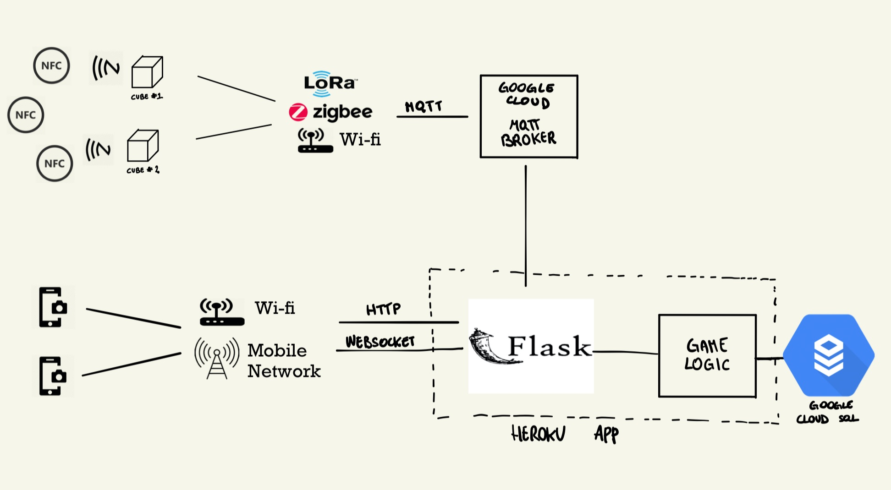

# Architecture

The system is composed of 5 main parts

- The wise cube
- NFC Tags
- A Webserver
- An MQTT broker
- Database

That should communicate in this fashion

The cube, with the help of an 8x8 led matrix display, will work as a digital companion for the museum and it's NFC reader and accelerometer will be used to trigger interactions and play a quiz game.

### The magic cube

The cube is approximately 5x5x5 cm and it's edges should be covered with a bump-resistant material like rubber.

The hardware is based on a NUCLEO STM32 board, prefrerably a small form factor one like the [nucleo-f042k6](https://www.st.com/content/st_com/en/products/evaluation-tools/product-evaluation-tools/mcu-mpu-eval-tools/stm32-mcu-mpu-eval-tools/stm32-nucleo-boards/nucleo-f042k6.html). 

 It is connected to the internet via WIFI (or possibly any other wireless communication method, as it only interacts with the server) and talks to an MQTT/SN gateway.

- On the front face there will be a **8x8 points Led Matrix** display, like the SK6812 or WS2812.
- Inside the cube there is **9 Axis Accelerometer, GyroScope and Magnetometer MPU-9250**
- It will have an **NFC reader like [PN532]**(https://www.amazon.it/HiLetgo-Communication-Arduino-Raspberry-Android/dp/B07ZWV1XZ1/ref=sr_1_4?dchild=1&keywords=pn532&qid=1588680467&sr=8-4) on the bottom face that will be used to distinguish different interactions, based on the values read from the cards.

Additionally, the remaining faces may host additional buttons for other interactions.

The cube will post and receive some messages over **MQTT**.

Cube interactions:

##### Start a new Group
This event is triggered with an NFC tag containing the constant `group_req` 
 When triggered it will do the following:

- Notify the server that a new group has been created by publishing on the `/cube/cube_id` channel
- Start to configure the first player
- Wait for another `group_req` card to end customization 

##### Add a new Player to current Group
This event is triggered automatically after a new group event
 When triggered it will do the following:

- Display a random icon on the top face
At this point, the player has two choices: 
- Accept the avatar by pressing a button
- Requesting a new random avatar by shaking the cube

- On acceptance it will notify the server by publishing on the `/cube/cube_id` channel

##### Start a new Game/Interaction

This event is triggered with an NFC tag containing the constant `game_req_X` 

 When triggered it will do the following:

- Notify the server a game has start by publshing a message over `cube_id/cube_id`
- Display the avatar of one of the players
- Detect pick up motion
- Detect roll motion
- Detect landing
- Validate roll
- Notify server of the result
- Wait the cube to be positioned over on the four `ans_X` NFC tags
- Notify the server of the answer
- Repeat for all players

### NFC Tags
An NFC tag is a simple integrated circuit with a memory storage, a radio antenna and some logic. They are passive devices, meaning that they do not have integrated battery and need an external source of power in order to work, in this case it is 'drawn' from the device that read it through induction. 

We actually need one of the game_req for each game/interaction we want to make available, and some of them for service operations, in total there will be the following cards:

- GROUP_REQ 

- ANS_A
- ANS_B
- ANS_C
- ANS_D
- GAME_REQ_1
- ...
- GAME_REQ_N

The GROUP_REQ will be used by the staff member to reset the magic cube, whereas the game_req are spread across the museum and will activate different games.

### Game Server 

The Game Server should implement both the http server and all the game logic.
It will subscribe to the MQTT broker and listen for incoming messages from the cube.
On a new publish it will update the database in a coherent way, publish a response over MQTT and notify the web clients via a web socket, in order to synchronize the screen with the current state of the cube.

For this reason the server should operate over three distinct channels:
- MQTT for receiving ( and eventually notifying ) events to the cube
- HTTP for displaying current state of the game on the screen
- WEBSOCKETS for notifying the client that a new state is available

The main idea is quite simple, the server will serve a series of webpages, one for each cube, containing the status of the game associated to that cube and can be visualized in 2 different ways, depending on the physical deployment on the cube:
- From screens connected to a low-power computer installed in the museum
- From the smartphone by visiting an url / scanning a QR code

### MQTT broker and MQTT/SN gateway

A simple MQTT broker that may be implemented with any technology.
It is only required to bridge the communication between the broker and the Game Server

It should only accept secure TLS connections.

Additionally we may need an MQTT/SN gateway for better supporting riot-os.

### Database
The database will contain the status of the group at any moment, therefore most of the game logic is implemented with the help of a consistent set of values and rules.

