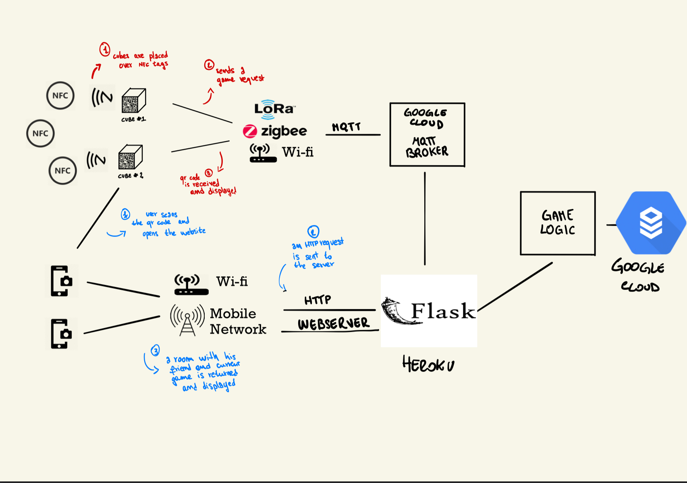

# Architecture

The system is composed of 5 main parts

- The wise cube
- NFC Tags
- A webserver
- An MQTT broker
- Database

That should communicate in this fashion



The cube, with the help of an LCD screen, will work as a digital companion for the museum guide and it's NFC reader will be used to trigger interactions.

Also, the cube will show a qr code that allows to 'register' a phone by simply visiting a link, after that, each time the same page is open again, it will display the current activity, allowing for additional interactions.


### The magic cube

The cube will mostly work as a proxy between the server and the phone/player.

The hardware is based on a NUCLEO_ST board, preferably a small form factor one like the [STM32](https://www.st.com/content/st_com/en/products/evaluation-tools/product-evaluation-tools/mcu-mpu-eval-tools/stm32-mcu-mpu-eval-tools/stm32-nucleo-boards/nucleo-f042k6.html). 

It is connected via WIFI (or possibly any other wireless communication method, as it only interacts with the server) and talks to an MQTT broker.

On the front face there will be an LCD display like [HD44780](https://www.winstar.com.tw/products/character-lcd-display-module/20x4-lcd-display.html) that will mainly display the QR code to join that group and additional informations, like a scoreboard, a timeout, additional descritptions, curiosisties and so on.
In addition it should give some sort of visual feedback to the user to inform in that the interaction has been correctly triggered.

It will have an NFC reader like [PN532](https://www.amazon.it/HiLetgo-Communication-Arduino-Raspberry-Android/dp/B07ZWV1XZ1/ref=sr_1_4?dchild=1&keywords=pn532&qid=1588680467&sr=8-4) on the bottom face that will be used to distinguish different interactions, based on the values read from the cards.

Additionally, the top face will contain some buttons to interact with the cube/

In order to interact with an NFC reader and a LCD screen we are going to use SPI with multiple slaves.

The cube will post and receive some messages over **MQTT/SN**.

Cube interactions:

###### Start a new Group
This event is triggered with an NFC tag containing the constant `group_req` 
 When triggered it will do the following:

- unsubscribe from all channels
- require a new cube id
- subscribe on `/cube/cube_id` 
- receive a qr code message on the previous topic
- display the `join_group` qr code

###### Start a new Game

This event is triggered with an NFC tag containing the constant `game_req` 

 When triggered it will do the following:

- post a `game_req <game_id>`  message over `cube_id/group_id`
- listen on the `/cube/cube_id` topic
- whenever a message is published, display it on the screen in the proper way ( it may be a countdown, a scoreboard, a question and so on ) 

### NFC Tags
An NFC tag is a simple integrated circuit with a memory storage, a radio antenna and some logic. They are passive devices, meaning that they do not have integrated battery and need an external source of power in order to work, in this case it is 'drawn' from the device that read it through induction. 

We actually need one of them for each game/interaction we want to make available and some of them for service operations, like resetting the cube's group ( we think that it's easier than button combinations ).

- GROUP_REQ 
- GAME_REQ
- EXPLAINATION_REQ
- ( GENERIC_HTML_REQ  for 3rd party integrations ? )

The GROUP_REQ will be used by the staff member to reset the magic cube, whereas the game_req are spread across the museum and will activate different games.

### Game Server 

The Game Server should implement both the http server and all the game logic.
It will subscribe to the MQTT broker and listen for incoming messages from the cube.
On a new publish it will update the database in a coherent way, publish a response over MQTT and notifying the web clients via a rest-API or a web socket.

The philosophy is the following: there are 2 communication MQTT for the cubes and HTTP(S) for the phone clients.

MQTT port 8883

HTTPS port 443

HTTP port 80 ( yes, it has  )

MQTT and HTTP rest API follow the same scheme: messages are encoded as a JSON object with one mandatory field: "type" that acts as a selector for the event to be triggered. The remaining fields are type-specific and may contain additional arguments.

A post or a topic will 'identify' the requestor  in fact both the cube and the phone are actually authenticated, the cube because it has a secret key and a signed certificate, the client beacuse it has a random token generated by the server, therefore we will encode all this information in the url like this.

```
http://gameserver/cube_id/group_id/player_id/game_id/access_token
mqtt://gameserver/cube_id/group_id
mqtt://gameserver/cube_id/group_id/player_id
```

the topic in MQTT corresponds to the URL in http, therefore we can share the code, treating a new message as an event, and dispatching the responses on the proper channel.

When a `game_req` request arrives on the MQTT channel `cube_id/group_id` it will have a structure like 

```
{
type:"game_req"
game_id: 0xAF00 
timestamp: 1587848908.49727
}
```

The server will check the group to which it belongs and republish on all the cubes belonging to the same group, in order to let them update their internal state.
Afterwards the server will publish the qr code for the players on the MQTT and start the HTTP listener

```
{
type:"qr_code"
payload: < encoded qr_code > 
}
```

the qr code will point to an URL like 

```
http://zubb-gameserver/cube_id/group_id/game_id/user_id/access_token
```

Where the access_token it's just a light but effective countermeasure that removes the chance of game jamming by simply changing `user_id`  in the url, you have to take a photo of the qr_code in order to join 😉

If the token is correct, it will answer with a web page displaying the game, and then users will answer a list of answers and  client/server and will communicate about the status of the game with messages like

SERVER -> CLIENT

````
{
"type":"question",
"number": 0x01
"title":"How did Julius Caesar die ?".
"ans": {
			 "A":"Slained by a tiger"
			 "B":"Killed by a fan"
			 "C":"Overdose"
			 "D":"He's still alive"
			}
}
````

CLIENT -> SERVER 

```
{
"type":"answer",
"ans": "A"
}
```

### MQTT broker / MQTTSN gateway

A simple mqtt broker that may be implemented with any technology.
It is only required to bridge the communication between the broker and the Game Server

It should only accept secure TLS connections.

Additionally we may need an mqtt/sn gateway for better supporting riot-os.

### Database
The database will contain the status of the group at any moment, therefore most of the game logic is implemented with the help of a consistent set of values and rules.

