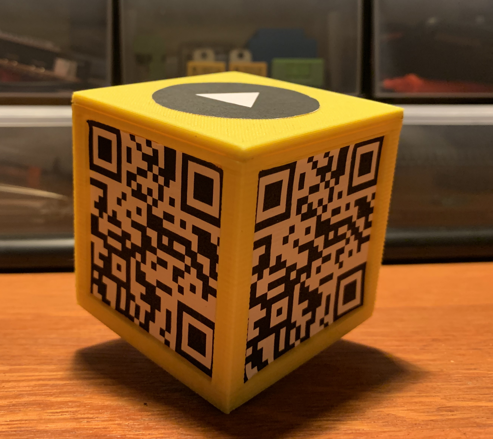

# Wise-Cube 
Wise-cube is a smart cube that allows visitors to play a trivial like game, with questions concerning the artworks they are surrounded by, with the help of NFC and QR codes!

### Authors

[Giulia Del Citto](https://www.linkedin.com/in/giulia-del-citto-316a8b1a3), 
[Diego Sonaglia](https://www.linkedin.com/in/diego-sonaglia-66a96915b), 
[Roberto Sorce](https://www.linkedin.com/in/roberto-sorce-52491512a)

### Mockup
Here there is a first mockup of the wise-cube itself!

 

### Links to the documents

Here you can find some useful informations

- Design document: [Link](Design/README.md)
- Architecture document: [Link](Architecture/README.md)  
- Evaluation document: [Link](Evaluation/README.md)  
- Presentation Video : Work in Progress
- Technical Video : Work in Progress

          
