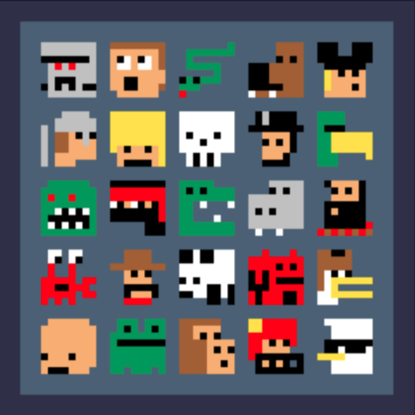
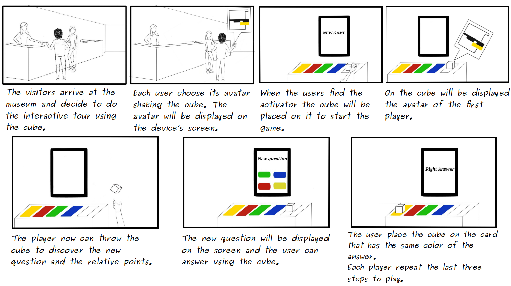

# Design 

###### Authors: Giulia Del Citto, Diego Sonaglia, Roberto Sorce

## Introduction

In this document we're concerned about the design aspects of the IoT system proposed for the big project presented for the elective in Internet of Things at "La Sapienza University of Rome".

The aim of the project, developed in co-operation with the ***Museum of Classical Arts*** of Sapienza University, is to improve the user experience during the tour, offering information with innovative techniques and a different kind of entertainment.

Our product offers a funny and interactive user experience, suited either for a single user, or for multiple users together. Single visitors can even find other participants to play with, so to challenge them and even socialise.

Once arrived at the museum, the users are prompted to use the device to start this new tour experience and to play a game with the artworks, otherwise they can go on, taking the classical tour. 

If the users decides to take the alternative tour with our product, the museum staff will provide the few instructions to use it.

## Product

##### Description

Wise-cube is an IoT device, provided by the museum: it is an interactive, multi-functional cube and an intelligent die that acts as a controller for an interactive quiz game.

The device has embedded:
   - ***ST-Microelectronics Nucleo board***
   - 8x8 Dot matrix LED display
   - A battery pack 
   - MPU 9250 sensor (Accelerometer + Gyroscope + Magnetometer)
   - NFC module.

When the visitors begin the experience, it is given a **Wise-cube**.

##### User experience
The game, will be described as a trivial quiz game, in which the players challenge themselves, learning about the artworks of the museum. The aim of the game is to gain the highest score. The game is mainly aimed for kids but it can be played by everyone.

Each user, before starting the interactive game, select his own __avatar__, by **shaking** the cube.
The **8x8 pixel avatar** identifies each player, and it is shown on the display.

In the museum there will be various placements, the **cube activators**, that consist of **one screen** and **five NFC Cards** and a **box activator** where the players throw the cube. In addition, if the users need it, instead of using the screen provided in each placement, they can use their own smartphones to display the questions of the game.

The players to start the game, will place Wise-cube on the activator, the cube randomly chooses a user and displays his avatar on the screen, the designated visitor picks it up. 

The cube will detect that the user has picked it up and notifies with an animation on the screen, now it's ready to be thrown. 

The player throws wise-cube and, with the help of an accelerometer, the cube will detect the face on which it landed, then, the player could obtain the number of points, shown on the screen, but only if the user answers correctly to the upcoming question.

The user is prompted with a question on the screen, if he answers correctly he will roll again the die, otherwise he will pass the turn to the next player.

Each player has one chance for each installment and the player that advances more is the winner at the end.

Wise-cube provides even an __interactive tour__. The device offers a dedicated tour experience for the kids, presenting a more simplified and enjoyable journey with respect to didactics, and their educational level and a regular tour for everyone.

When the users start their tour through the rooms of the museum, they will discover the ___activators___ where to place the IoT device near the artworks and it will display the corresponding user avatar to start the journey through the museum, guided by our prototype and playing the game level. Depending on the answer to the question, the player will discover a curiosity about the artworks.

Once the users have completed the visit at the museum, they have completed also all the game levels and at the end the user who have gained the highest score wins the game. 

## Personas

We identified the user target of our product, introducing the following personas:

__Persona 1__: Carlo is a 8 years old kid that lives in Rome, he attends the Elementary school. Carlo likes movies, to read novel books and playing board games and videogames on his smartphone.

1. Persona

   Name: Carlo  
   Surname: Verdone  
   Age: 8 y.o.   
   Gender: Male  
   Education: Elementary school   
   Career type: Student    
   Income: None  

__Persona 2__: Valentina is a 46 years old mom, she's a Mechanical engineer Professor at La Sapienza University. She likes playing with her son Carlo and in the free time, she likes to visit museums.

2. Persona

   Name: Valentina   
   Surname: Rossi  
   Age: 46 y.o.   
   Gender: Female  
   Education: Doctoral degree  
   Career type: Professor  
   Income: 60.000€  

__Scenario__: Saturday morning, Valentina and Carlo are free, they decide to spend the mornign together visiting a museum, so they decide to go the Museum of Classical Arts of Sapienza University, where Carlo can learn while having fun with his mom. 

__Persona 3__: Alessandra attends the artistic high school in Tivoli. She likes to hang out with her friends, to practice sports, photography and painting. During the weekends she likes to visit and discover new places and especially to visit museums.

3. Persona

   Name: Alessandra  
   Surname: Borghi  
   Age: 18 y.o.   
   Gender: Female  
   Education: High school  
   Career type: Student  
   Income: None

__Scenario__: The school organised a school trip in Rome, to visit the monuments and the museums of the capital city. Among the many museums of the city, the school decided to visit the Museum of Classical Arts of Sapienza university. Here they will be divided in groups and start visiting the museum with the new device. Thanks to the cube and the interactive games, they challenge each other groups discovering interesting facts about the artworks.

## Storyboard

